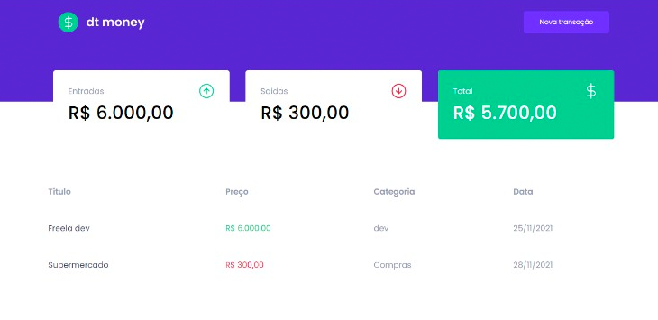

<p align="center">
   
</p>


<p align="center">
  :💸: Manage your finances more effectively with this amazing app!
</p>


<div align="center">
   
</div>

## :rocket: Technologies
This project was made using the follow technologies:

* [TypeScript](https://www.typescriptlang.org/)      
* [ReactJS](https://reactjs.org/)      
* [MirageJS](https://miragejs.com/)
* [Styled Components](https://styled-components.com/)


## :computer: How to run

```bash
# Clone repository
$ git clone https://github.com/debfdias/ignite-reactjs/

# Access folder 
$ cd chapter_ii/dt_money
```

```bash
# Install dependencies
$ yarn

# Run aplication
$ yarn start
```
Go to http://localhost:3000/ 


## :page_facing_up: License

This project is licensed under the [MIT license](./LICENSE).
