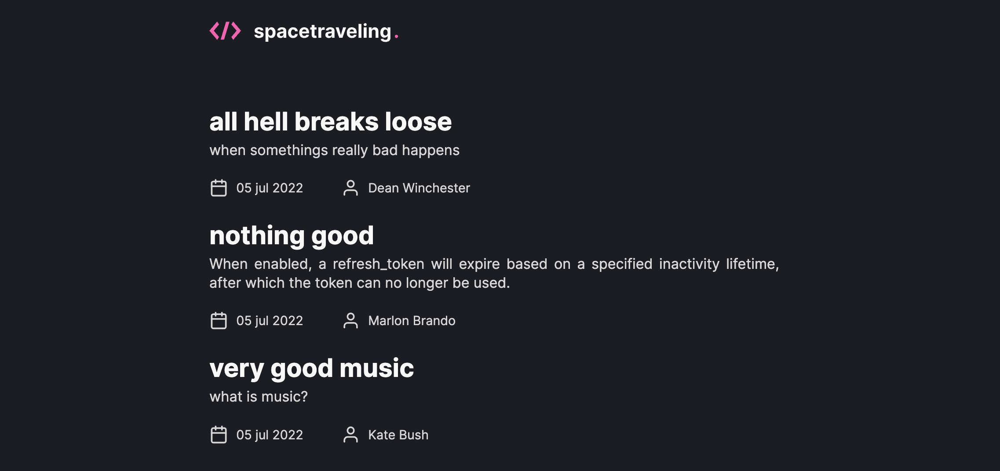

</h1>

<p align="center">
   
</p>

<p align="center">
 📰 A blog from outer space! 👽 🔭 🚀
  <br>
</p>

---

<div align="center">
   
</div>

<br>

## :rocket: Technologies ##

This project was made using the follow technologies:

* [Next.js](https://nextjs.org/)
* [TypeScript](https://www.typescriptlang.org/)    
* [Prismic CMS](https://prismic.io/)

## :computer: How to run ##
```bash
# Clone this project
$ git clone https://github.com/debfdias/ignite-reactjs/

# Access folder 
$ cd chapter_iii/challenge05

# Install dependencies
$ yarn install

# Run the project
$ yarn dev

# Go to <http://localhost:3000>
```

## :checkered_flag: Aditional configuration and .env variables ##

### 1. Prismic configuration

- Create a free account in Prismic;
- Create a new repository using Next.js;
- Go to 'Settings > API & Security', copy the API endpoint address into the the .env.local file variable:

```bash
PRISMIC_API_ENDPOINT=
```

- To create the Custom Types, in a new terminal (inside your repository folder), run the the commands:

```bash
npx @slicemachine/init --repository YOUR_REPOSITORY_NAME
npm run slicemachine

# Go to <http://localhost:9999>
```
- Now click in the "Create a Custom Type" and define it as a repeatable type "Posts";
- Create the necessary fields;
- Click in "Push to Prismic";
- Access your Prismic Dashboard and create some posts to populate the database;


