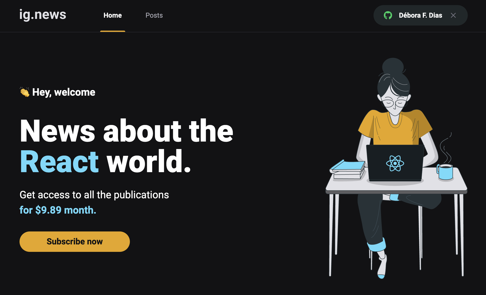

</h1>

<p align="center">
   
   
</p>

<p align="center">
 📰 A daily React newsletter. Always Stay Up-to-Date!
  <br>
</p>

---

<div align="center">
   
</div>

<br>

## :dart: About ##
Ig.news is a blog where users can subscribe to receive monthly content about React JS. 
<br>
Content creation is done through Prismic.io, and subscription and payment management is done through Stripe.
<br>
User, subscription and post data are stored in FaunaDB.
<br>

## :rocket: Technologies ##

This project was made using the follow technologies:

* [Next.js](https://nextjs.org/)
* [TypeScript](https://www.typescriptlang.org/)    
* [Prismic CMS](https://prismic.io/)
* [Stripe](https://stripe.com/)
* [FaunaDB](https://fauna.com/)

## :computer: How to run ##
```bash
# Clone this project
$ git clone https://github.com/debfdias/ignite-reactjs/

# Access folder 
$ cd chapter_iii/ignews

# Install dependencies
$ yarn install

# Run the project
$ yarn dev

# Go to <http://localhost:3000>
```

## :checkered_flag: Aditional configuration and .env variables ##

### 1. Stripe configuration

- Create a Stripe account;
- Create a business;
- Create the product (Subscription) and define its price;
- Go to 'Products', copy the API ID of its price and paste it into the .env.local file variable:

```bash
STRIPE_SUBSCRIPTION_PRICE_ID=
```
- Go to 'Development > API Keys' and copy the public key and secret key into the .env.local file variables:

```bash
STRIPE_API_KEY=
NEXT_PUBLIC_STRIPE_PUBLIC_KEY=
```
- In another terminal, run the following command to connect the Stripe Webhooks:

```bash
stripe listen --forward-to localhost:3000/api/webhooks
```

- Copy the key into the following .env.local file variable:

```bash
STRIPE_WEBHOOK_SECRET=
```

### 2. Github configuration

- Access your Github account and go to 'Settings > Developer settings > OAuth apps' and create an application;
- Set the Homepage URL as 'http://localhost:3000/';
- Set the Callback URL as 'http://localhost:3000/api/auth/callback';
- Copy the Client ID and Client secret into the .env.local file variables:

```bash
GITHUB_CLIENT_ID=
GITHUB_CLIENT_SECRET=
```

### 3. FaunaDB configuration

- Create a free account in FaunaDB;
- Create a database;
- Create the collections: users, subscriptions;
- Create the indexes setting the terms (parenthesis): subscription_bby_id (data.id), subscription_by_status (data.status), subscription_by_user_ref (data.userId), user_by_email (data.email), user_by_stripe_customer_id (data.stripe_customer_id);
- Now go to 'Security > New key' create a key and then copy it into the .env.local file variable:

```bash
FAUNADB_KEY=
```

### 4. Prismic configuration

- Create a free account in Prismic;
- Create a new repository using Next.js;
- Go to 'Settings > API & Security', copy the API endpoint address into the the .env.local file variable:

```bash
PRISMIC_ENDPOINT=
```

- Change the API access to "Public API fos Master only" and save it;
- In the "Generate an Access Token" section, create a new token, then copy the "Permanent access token" into the the .env.local file variable:

```bash
PRISMIC_ACCESS_TOKEN=
```
- To create the Custom Types, in a new terminal (inside your repository folder), run the the commands:

```bash
npx @slicemachine/init --repository YOUR_REPOSITORY_NAME
npm run slicemachine

# Go to <http://localhost:9999>
```
- Now click in the "Create a Custom Type" and define it as a repeatable type "Posts";
- Add the id (uid), title (rich text) and content (rich text) fields in the static zone;
- Click in "Push to Prismic";
- Access your Prismic Dashboard and create some posts to populate the database;

## :framed_picture: Screenshots ##

<h1 align="center">
    
    
</h1>


