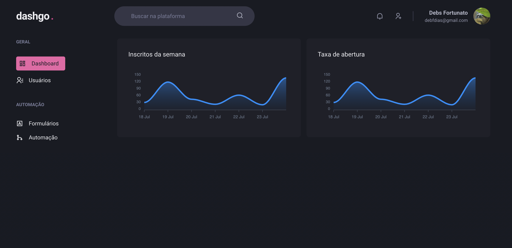
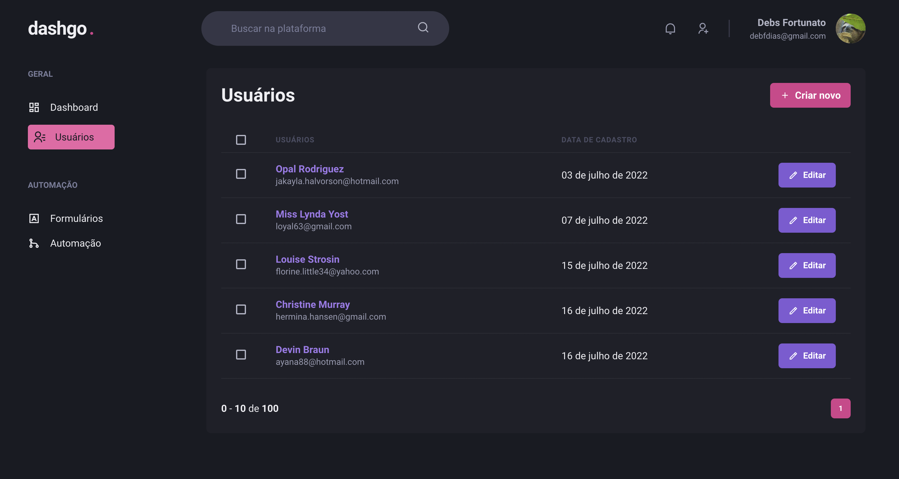

</h1>

<p align="center">
   
</p>

<p align="center">
 📈 A smart dashboard to your business. Don't miss a thing!
  <br>
</p>

---

<div align="center">
   
</div>

<br>

## :dart: About ##
Dashgo is a complete subscriptions management dashboard. Don't miss a single detail with this modern and fast tool. ] 
<br>
<br>

## :rocket: Technologies ##

This project was made using the follow technologies:

* [Next.js](https://nextjs.org/)
* [TypeScript](https://www.typescriptlang.org/)    
* [Chakra.ui](https://chakra-ui.com/)
* [React Query](https://react-query-v3.tanstack.com/)
* [Mirage JS](https://miragejs.com/)

## :computer: How to run ##
```bash
# Clone this project
$ git clone https://github.com/debfdias/ignite-reactjs/

# Access folder 
$ cd chapter_iv/dashgo

# Install dependencies
$ yarn install

# Run the project
$ yarn dev

# Go to <http://localhost:3000>
```

## :framed_picture: Screenshots ##

<h1 align="center">
    
    
</h1>


